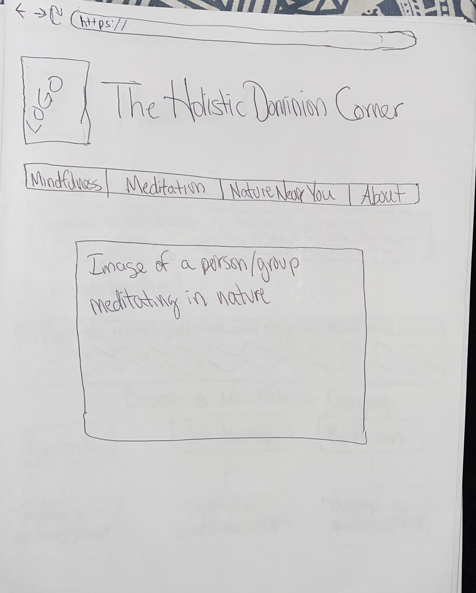
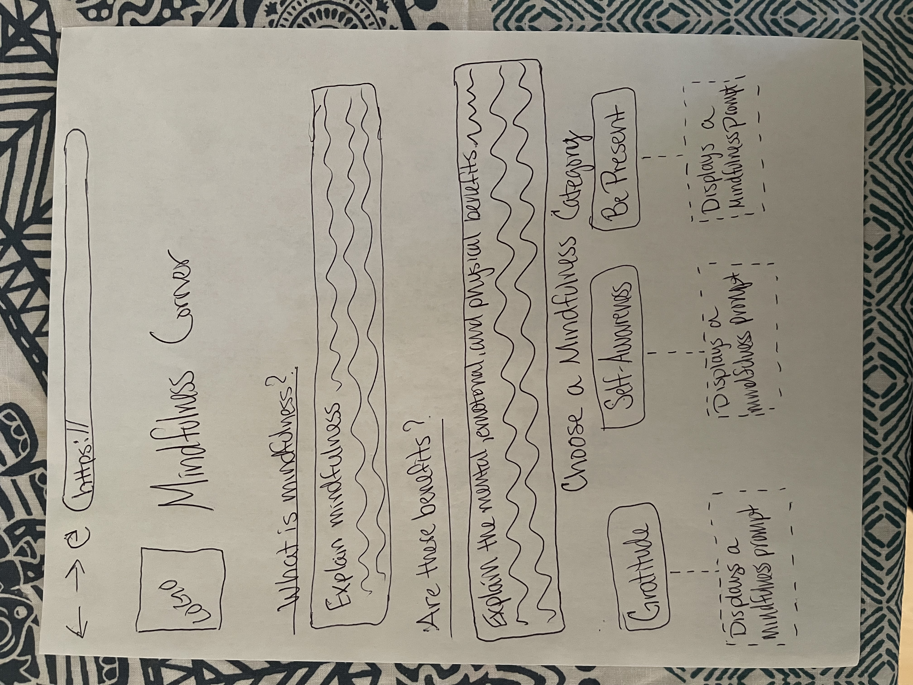
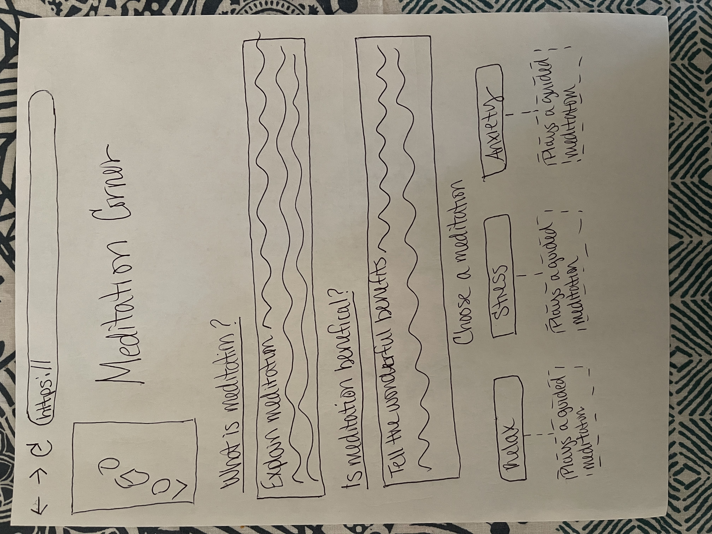
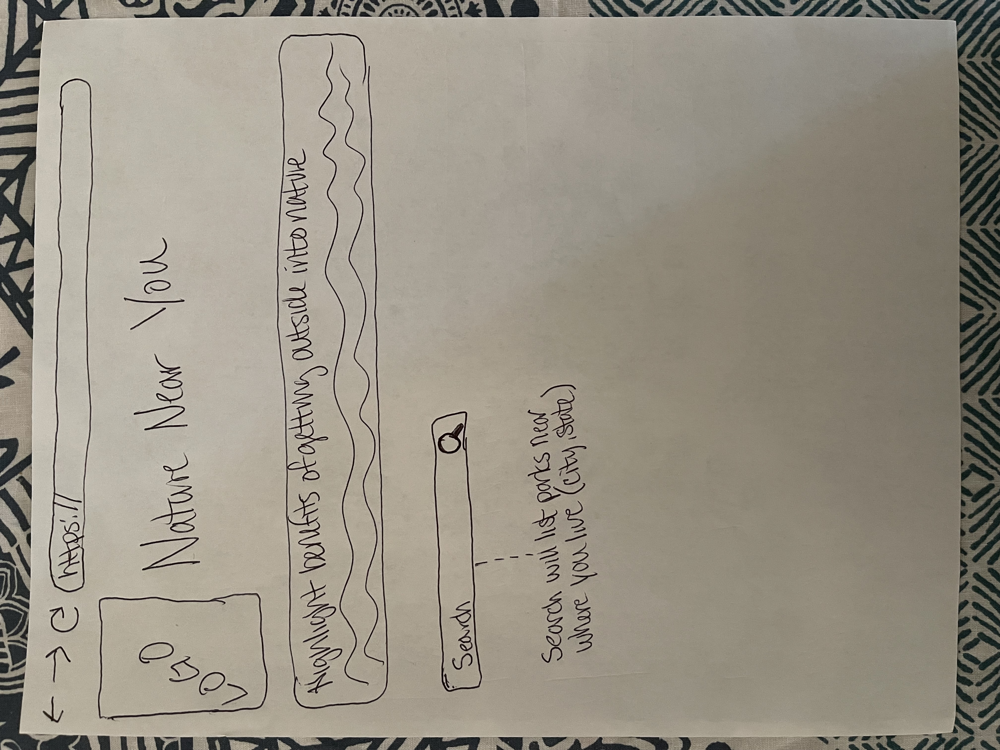
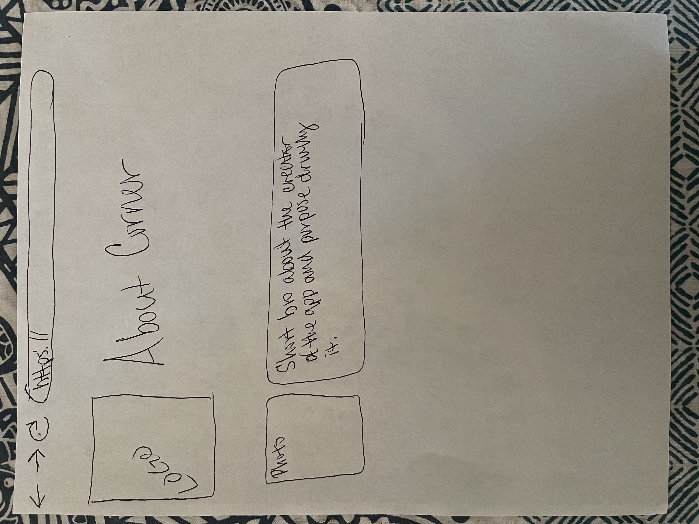

# Capstone Project Planning Week 1 Homework

### Please complete each section below

- Write a Definition Statement
  - I want to build an application that...
    - **Helps people deal with relaxation,  stress and anxiety, and, provide a tool for people to find nature locations to accompany their meditation/mindfulness practice **
- Define your Audience
  - Who is using my application
    - **People who want a holistic approach to stress, relaxation, and anxiety.**
- Outline the content of the application
  - What do I want on each page?  (text / pics / images / navigation)? What do I want the functionality of each page to be?
    - **Pics, information, audio/videos that will help with the purpose of the website**
  - What is the purpose of my application?
    - **Give a holistic approach to managing stress, anxiety in a educational/fun way.**
  - What business problem or real world problem am I going to be solving?
    - **Provides access to basic tools to those items above free of charge.**
  - Define the attributes of your website
    - Color Palette
      - **Teal, Blue, Tan, Brown, and White**

 - Images
      - **Different images showing meditating/mindfulness**

    - Fonts
      - **Still deciding**
    - Logos
      - !["Holistic Dominion" logo:]

    - Navigation
      - **Navigation done primarily through top menu bar and labeled menu buttons on page**
- Create and provide
![User Story Map]
**[Mural link](https://app.mural.co/t/brendonsteam2253/m/brendonsteam2253/1733069867341/71a11017e8fd373f99ffe3bcf06e701b569afbc0)**
[Mindfulness.com] (https://mindfulness.com/)
  - Likes:
    - expansive content to choose from
    - has different courses on multiple topics
  - Dislikes:
    - Too much content
[Mindful.org](https://www.mindful.org/)
  - Likes:
    - Very simplistic in style
    - gets straight to the point.
  - Dislikes:
    - lengthy meditations and not short ones for beginners
**How my application will be different:**
  - Will give short guided meditations for beginners free of charge at all times.
  - Will offer a search to find nature locations to get outdoors to do meditations.
  - As I develop the app I will incorporate longer guided meditations for subscribers.
  - Will add some excitement and character, and personality to the website as a whole.

- Create wireframes and provide link for each page (minimum of 4-5 pages) including Home, About Me, Contact Us and 1-2 other pages demonstrating the specific functionality of your capstone's purpose.
[Wireframes]

- Will use <b>OpenStreetMap (OSM) Overpass API for this feature.<b>

- Create and provide link to User Flow Diagram

**[SWOT Analysis](https://docs.google.com/document/d/1k4WifzdrerqYtK7CjP_RCMqCUJ_vlGXUCiaEZbUm9DA/edit?usp=sharing)**
